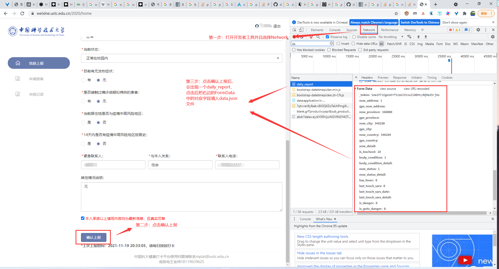

<center><h1>ustc每日健康打卡</center></h1>

## 如何使用

**第一步**

编辑`data.json`文件，填写学号和密码。

**第二步**

打卡[ustc健康打卡网站](https://weixine.ustc.edu.cn/2020/login)，登录你的帐号，按下`F12`打开开发者工具，点击确认上报按钮，在开发者工具中会出现一个名字为`daily_report`的请求，点击后将右边窗格中`Form Data`中的对应字段填入`data.json`文件中（其中token字段无需填充）。



**第三步**

运行程序

```
pip install -r requirements.txt --user
nohup ./report_every_day &
```

## License

MIT License
